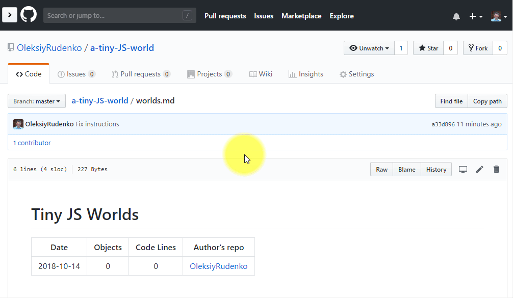
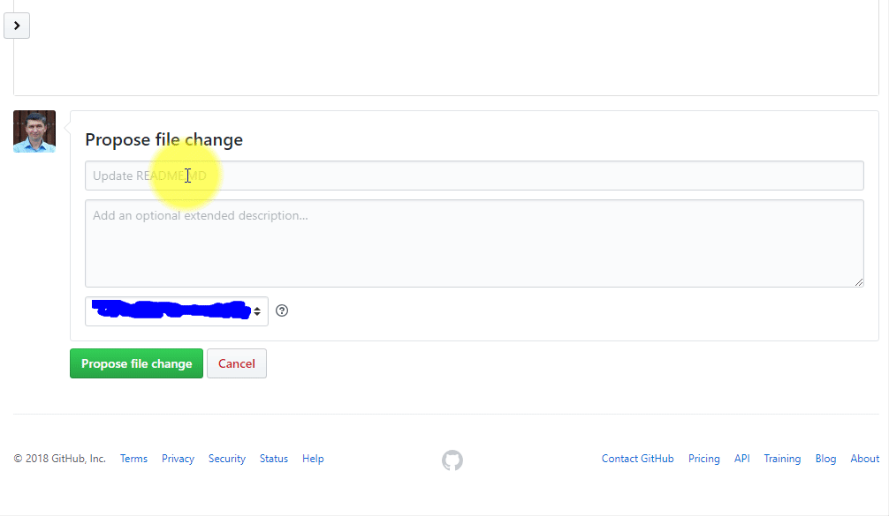

# A Tiny JS World

This is a tiny task for those who are not familiar with
Object-Oriented Programing concepts yet.
And with JavaScript OOP in particular.

## About you

1. You know JavaScript basics.

1. You don't know any OOP or at least JavaScript specific OOP.

## The story

There is a tiny world inhabited by a dog, a cat, a woman,
a man, and sometimes by a cat-woman.

You will be creating a JavaScript model of this world.

## Instructions

### Preparations

1. Fork [this repo](https://github.com/OleksiyRudenko/a-tiny-JS-world)

   

1. Clone your fork locally

1. `index.html` is what you will work with. Put your code
   between `` tags.

You may want manipulate DOM for prettier output, but
try focusing more on code itself.

### The job

 1. Define objects representing this world inhabitants:
    a dog, a cat, a woman, and a man.
    - Each object has legs, hands (optional, naturally),
      a name, is of certain gender and also can say
      something relevant, like "meow" or "Hello Jenny!".
 1. List inhabitants. Each list entry should like
    `human, John, male, 2, 2, Hello world!`
    - if inhabitant has no hands then
      skip it or report `0` or `undefined` - up to you
 1. Optional: Define an object representing cat-woman.
    - cat-woman's saying should be exactly the same as
      cat's
    - whenever you change cat's saying cat-woman's saying
      should change accordingly - they are strongly tied
      on some astral level
 1. Push your repo to github

_Instructions above are also available in `index.html`_.

Doing `var object1 = object2` and `object2.name='Anny'`
results in changing name of `object1`?

Click me!

    Read about
    [Copying Objects in JavaScript](https://scotch.io/bar-talk/copying-objects-in-javascript)

### What's next

You're done? Congratulations!

Did you like the experience?
Grant this repo a :star:!

#### List your repo

1. Navigate to [A Tiny JS World root repo worlds list](https://github.com/OleksiyRudenko/a-tiny-JS-world/blob/master/worlds.md)

1. Edit the file
   * Click **Edit this file** button

   * Copy the very first line in the table, go all way down
     to the end of the table, insert the copy as
     the last row in the table, and edit it as
     appropriate specifying:
     - current date as YYYY-MM-DD
     - number of objects you created
     - number of code lines your object definitions take
     - your github nick in square brackets
       and link to your repository in parentheses

   * Switch to Preview tab to check if the table still looks
     nice.

   

1. Submit changes
   * Scroll down to **Propose file change**
   * Type "List a tiny JS world by <your name>" in commit subject
   * Click **Propose file change** button.

   

You are done here!

_Please, note that PRs may not be merged very soon. Thank you
for your patience._

#### Code review

If you have completed this task as a part
of [Kottans Front-End Course](https://github.com/kottans/frontend)
ask a course mentor or classmates to support you.
Check this task intro within the course for instructions.

Otherwise, ask someone to review your code and come up with
explanations on how it could be completed with OOP
in mind. It is always good to explain yet another
approach on some working code.

Keep in mind that this was just a tiny world and
whenever you need to build bigger worlds
Object Oriented Programming concepts come
to your rescue.

#### Learn on your own

The following will help you to make yourself familiar
with OOP and JavaScript OOP.

- [How to explain object-oriented programming concepts to a 6-year-old](https://medium.freecodecamp.org/object-oriented-programming-concepts-21bb035f7260)
- [Object-oriented JavaScript for beginners](https://developer.mozilla.org/en-US/docs/Learn/JavaScript/Objects/Object-oriented_JS)
- [Object oriented programming in javascript](https://www.sohamkamani.com/blog/2016/04/30/oops-in-js/)

Consider completing
[Object-Oriented Javascript](https://github.com/kottans/frontend/blob/master/tasks/js-oop.md)
from [Kottans Front-End Course](https://github.com/kottans/frontend).

Some extras related to OOP:
 - [DRY, KISS, YAGNI](https://code.tutsplus.com/tutorials/3-key-software-principles-you-must-understand--net-25161)
 - [SOLID](https://medium.com/@cramirez92/s-o-l-i-d-the-first-5-priciples-of-object-oriented-design-with-javascript-790f6ac9b9fa)

## Credits

This repo is dedicated to my elder son Yaroslav who turned
18 on this repo creation date.

This Tiny JS World project wouldn't ever happen without
[Kottans](http://kottans.org/) and awesome
[Kottans Front-End Course](https://github.com/kottans/frontend)
(it's free and offers a totally remote tasks)
I have completed as a student in 2017 and since then
have a chance to contribute thus paying back.

Special thanks to [Anastasiya Mashoshyna](https://github.com/AMashoshyna),
[Yevhen Orlov](https://github.com/yevhenorlov) and other
[Kottans](https://github.com/kottans) for the discussion, feedback,
and support that resulted in this project creation.
